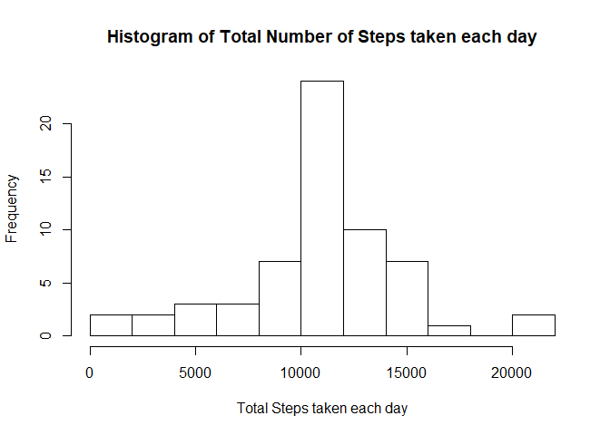

# Reproducible Research: Peer Assessment 1
Author: Luis Padua  
Date: July, 30th - 2017

This assignment makes use of data from a personal activity monitoring device. This device collects data at 5 minute intervals through out the day. The data consists of two months of data from an anonymous individual collected during the months of October and November, 2012 and include the number of steps taken in 5 minute intervals each day.  


## Loading and preprocessing the data
Raw data for this assignment can be found at [Activity Monitoring Data](https://d396qusza40orc.cloudfront.net/repdata%2Fdata%2Factivity.zip)  
As preprocessing steps, I considered the following:  
- Using the library dplyr to let the data as a tbl_df  
- Convert the string date column to a Date Variable Time


```r
library(dplyr)
```

```
## 
## Attaching package: 'dplyr'
```

```
## The following objects are masked from 'package:stats':
## 
##     filter, lag
```

```
## The following objects are masked from 'package:base':
## 
##     intersect, setdiff, setequal, union
```

```r
data <- read.csv(unz("activity.zip", "activity.csv"))
data$date <- as.Date(data$date)
data <- tbl_df(data)
```

## What is mean total number of steps taken per day?


```r
stepbyday <- data %>%
                group_by(date) %>%
                summarise(steps = sum(steps))
hist(stepbyday$steps, breaks = 10,
     main = "Histogram of Total Number of Steps taken each day",
     xlab = "Total Steps taken each day")
```

<!-- -->

```r
step_mean <- mean(stepbyday$steps, na.rm = TRUE)
step_median <- median(stepbyday$steps, na.rm = TRUE)
```
The mean total number of steps taken per day is 10766.2.  
And its median is 10765.

## What is the average daily activity pattern?

```r
avgstepbyinterval <- data %>%
                group_by(interval) %>%
                summarise(avgsteps = mean(steps, na.rm = TRUE))
labeltime <- c("00:00",
                              "01:00",
                              "02:00",
                              "03:00",
                              "04:00",
                              "05:00",
                              "06:00",
                              "07:00",
                              "08:00",
                              "09:00",
                              "10:00",
                              "11:00",
                              "12:00",
                              "13:00",
                              "14:00",
                              "15:00",
                              "16:00",
                              "17:00",
                              "18:00",
                              "19:00",
                              "20:00",
                              "21:00",
                              "22:00",
                              "23:00",
                              "24:00")
plot(avgstepbyinterval$interval, avgstepbyinterval$avgsteps,
     type = 'l',
     xlab = "Time Interval during the Day",
     ylab = "Average of Steps during the Interval",
     axes = FALSE)
axis(1, at = seq(0, 2400, 100), labels = labeltime)
axis(2, at = seq(0, 210,50))
```

<!-- -->

```r
maxInterval <- avgstepbyinterval$interval[which.max(avgstepbyinterval$avgsteps)]
```
The 5-minute interval, on average across all the days in the dataset, that contains the maximum number of steps is 835


## Imputing missing values


```r
arrayNA <- is.na(data$steps)
numNA <- sum(arrayNA)
```
The total number of invalid observations is 2304  

The strategie used to replace the NA value is to use the mean for that specific interval from the whole dataset.


```r
data_woNA <- data
for(i in 1:length(data$steps)) {
        if(arrayNA[i] == TRUE) {
                data_woNA$steps[i] <-      avgstepbyinterval$avgsteps[avgstepbyinterval$interval == data_woNA$interval[i]]
        }
}
```

Then, let's re-do the histogram of the steps by day.  

```r
stepbyday_woNA <- data_woNA %>%
                group_by(date) %>%
                summarise(steps = sum(steps))
hist(stepbyday_woNA$steps, breaks = 10,
     main = "Histogram of Total Number of Steps taken each day",
     xlab = "Total Steps taken each day")
```

<!-- -->

```r
step_mean_woNA <- mean(stepbyday_woNA$steps)
step_median_woNA <- median(stepbyday_woNA$steps)
```
The mean total number of steps taken per day is 10766.2.  
And its median is 10766.2.  
Removing the NA values has an impact on the median calculation. Without NA values, median has the same value of mean.

## Are there differences in activity patterns between weekdays and weekends?


```r
data_woNA$weekday <- factor(weekdays(data_woNA$date) %in% c("Saturday", "Sunday"), 
         levels=c(FALSE, TRUE), labels=c('weekday', 'weekend') )
avgstep_weekend <- filter(data_woNA, as.integer(weekday) == 2) %>%
                group_by(interval) %>%
                summarise(avgsteps = mean(steps))
avgstep_weekday <- filter(data_woNA, as.integer(weekday) == 1) %>%
                group_by(interval) %>%
                summarise(avgsteps = mean(steps))

par(mfrow=c(2,1),
          oma = c(5,4,0,0) + 0.1,
          mar = c(0,0,1,1) + 0.1)

plot(avgstep_weekday$interval, avgstep_weekday$avgsteps,
     type = 'l', ylim = c(0,250),
     axes = FALSE)
text(c(1200,250), "On Weekdays", pos = 4)
axis(1, at = seq(0, 2400, 100), labels = FALSE)
axis(2)

plot(avgstep_weekend$interval, avgstep_weekend$avgsteps,
     type = 'l', ylim = c(0,250),
     axes = FALSE)
text(c(1200,250), "On Weekend", pos = 4)
axis(1, at = seq(0, 2400, 100), labels = labeltime)
axis(2)
title(xlab = "Time Interval during the Day",
      ylab = "Average Steps",
      outer = TRUE, line = 3)
```

<!-- -->

